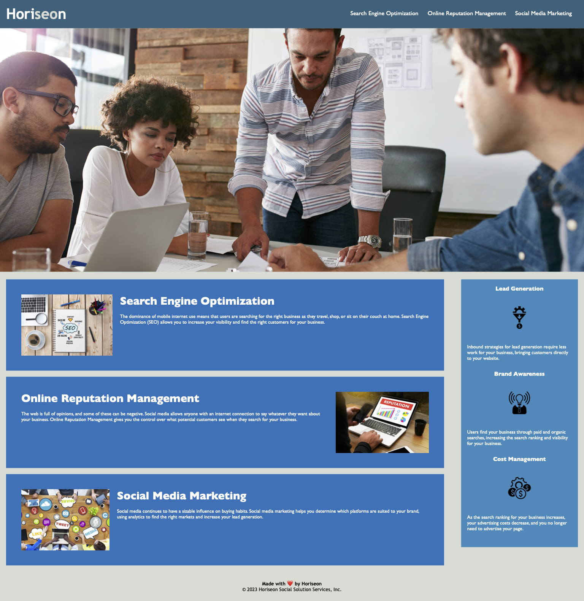

# Coding Bootcamp Challenge #1

The project is to refactor the home page of a Marketing company to make the website more accessible and to clean up the code. Specifically:

  - semantic HTML elements were used instead of generic DIVs
  - ALTs were added to all images to improve accessibility
  - CSS file was reorganized to improve maintainability
  - descriptive comments were added to HTML and CSS files
  
The final version is deployed on GitHub Pages at https://clstevenson.github.io/Challenge-1/. Note that this is a fictional web page and company (so far as I know). This is an assignment for Coding Bootcamp. The final website looks like the image below.

